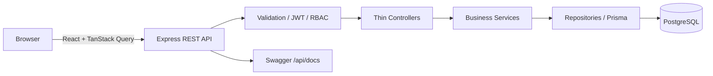
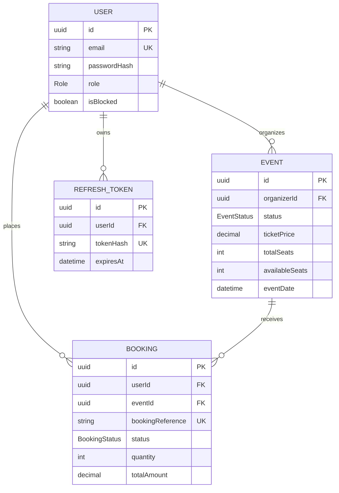

# Evently — Production-Style Event Booking System

Evently is a full-stack marketplace where attendees discover and book events, organizers manage inventory and sales, and administrators moderate the platform. It is designed as an SDE portfolio project with real authentication, relational persistence, transactions, RBAC, testing, documentation, containers, and CI—not a mock API.

## Features

- JWT access tokens plus rotating, revocable refresh tokens in secure HTTP-only cookies
- `USER`, `ORGANIZER`, and `ADMIN` permissions with ownership checks and blocked-user enforcement
- Event drafting, approval, rejection, publishing, cancellation, search, filters, sorting, and pagination
- Atomic ticket inventory claims that prevent overselling under concurrent requests
- Booking history and cancellation with a 24-hour deadline and transactional seat restoration
- Organizer sales views/statistics and platform-wide admin moderation/statistics
- Responsive React UI with protected routes, validation feedback, loading/empty/error states, toasts, and confirmations
- Zod input validation, consistent API envelopes, centralized errors, Helmet, CORS, rate limits, Pino logging, and Swagger
- Prisma/PostgreSQL schema, deterministic seed data, integration tests, Docker Compose, and GitHub Actions CI

## Architecture



The backend follows `Route → Middleware → Controller → Service → Repository → Database`. Repository extraction is used for shared user and event persistence; transaction-heavy booking operations intentionally use the transaction-scoped Prisma client directly inside the service.

### Concurrency design

Booking runs in a PostgreSQL transaction. After validating the user and event, it issues one conditional update:

```sql
UPDATE "Event"
SET "availableSeats" = "availableSeats" - :quantity
WHERE id = :eventId AND status = 'PUBLISHED'
  AND "availableSeats" >= :quantity;
```

PostgreSQL serializes competing writes to the row and rechecks the predicate. Exactly one request can claim the final seats; a zero-row update becomes HTTP `409`, and booking creation is rolled back if any subsequent step fails. Cancellation updates the booking and restores seats in one transaction.

## Data model



## Technology

| Layer | Technology |
|---|---|
| Frontend | React 19, TypeScript, Vite, React Router, Tailwind CSS, Axios, TanStack Query, React Hook Form ecosystem, Zod |
| Backend | Node.js, Express, TypeScript, Prisma, PostgreSQL, JWT, bcrypt, Zod |
| Quality | Jest, Supertest, ESLint, Prettier, strict TypeScript |
| Operations | Docker, Docker Compose, Nginx, GitHub Actions, Pino, Swagger/OpenAPI |

## Project structure

```text
.
├── backend
│   ├── prisma/                 # Schema, migration, seed
│   ├── src
│   │   ├── config/             # Environment, Prisma, logger, Swagger
│   │   ├── controllers/        # HTTP adapters
│   │   ├── errors/             # Typed application errors
│   │   ├── middleware/         # Auth, RBAC, validation, errors
│   │   ├── repositories/       # Reusable persistence operations
│   │   ├── routes/             # REST route definitions
│   │   ├── services/           # Business rules and transactions
│   │   ├── types/              # Express type augmentation
│   │   └── utils/              # Tokens and HTTP helpers
│   └── tests/                  # Integration and concurrency tests
├── frontend
│   └── src                     # React app, API/auth state, UI, types
├── .github/workflows/ci.yml
└── docker-compose.yml
```

## Local setup

Requirements: Node.js 22+, npm 10+, PostgreSQL 16+.

```bash
npm install
cp backend/.env.example backend/.env
cp frontend/.env.example frontend/.env
npx prisma generate --schema backend/prisma/schema.prisma
npx prisma migrate dev --schema backend/prisma/schema.prisma
npm run seed -w backend
npm run dev
```

Frontend: `http://localhost:5173`  
API: `http://localhost:4000/api`  
Swagger: `http://localhost:4000/api/docs`

### Environment variables

Backend requires `DATABASE_URL`, `PORT`, `NODE_ENV`, `JWT_ACCESS_SECRET`, `JWT_REFRESH_SECRET`, `ACCESS_TOKEN_EXPIRY`, `REFRESH_TOKEN_EXPIRY`, `FRONTEND_URL`, and `COOKIE_SECRET`. Use random values of at least 32 characters for secrets. Frontend uses `VITE_API_BASE_URL`. Actual `.env` files are ignored.

## Docker

```bash
docker compose up --build
docker compose down
```

The app is then available at `http://localhost:3000`; the API remains at `http://localhost:4000`. PostgreSQL data persists in the named `postgres_data` volume. Do not use `docker compose down -v` unless you intend to delete local database data.

## Database commands

```bash
npx prisma migrate dev --schema backend/prisma/schema.prisma
npx prisma migrate deploy --schema backend/prisma/schema.prisma
npm run seed -w backend
npx prisma studio --schema backend/prisma/schema.prisma
```

## Tests and quality checks

Integration tests require an empty PostgreSQL database named `event_booking_test` (or set `TEST_DATABASE_URL`). Tests clean that database, so never point it at development or production data.

```bash
npm run typecheck
npm run lint
npm test
npm run build
```

The test suite covers registration, duplicate email, valid/invalid login, protected access, role restrictions, organizer ownership, admin approval, booking validation, cancellation ownership and inventory restoration, and concurrent booking without overselling.

## Development seed credentials

All seeded accounts use `Password123!` for local development only.

| Role | Email |
|---|---|
| Admin | `admin@evently.dev` |
| Organizer | `organizer1@evently.dev` |
| Organizer | `organizer2@evently.dev` |
| User | `user1@evently.dev` |
| User | `user2@evently.dev` |
| User | `user3@evently.dev` |

## Main API routes

- Authentication: `POST /api/auth/register`, `login`, `refresh`, `logout`; `GET /api/auth/me`
- Events: `GET /api/events`, `/api/events/:id`; organizer `POST`, `PATCH`, `DELETE`, `submit`, and `cancel`
- Bookings: `POST /api/bookings`; `GET /api/bookings/my`, `/api/bookings/:id`; `PATCH /api/bookings/:id/cancel`
- Organizer: `GET /api/organizer/events`, `/stats`, `/events/:eventId/bookings`
- Admin: `GET /api/admin/stats`, `/users`, `/events`, `/bookings`; user blocking and event approval/rejection/cancellation routes

All JSON responses use `{ success, message, data }` or `{ success, message, errors }`.

## Screenshots

Add portfolio screenshots here after running the seeded application:

- Home and event discovery
- Event details and booking confirmation
- Organizer overview and event management
- Admin moderation dashboard

## Future improvements

Payment-provider integration, email delivery, QR tickets, refunds, audit logs, Redis caching, waitlists, coupons, organizer CSV exports, accessibility auditing, and end-to-end browser tests are intentionally left as production extensions. The current booking flow records confirmed bookings without charging a payment method.

## Resume-ready description

> Built a role-based event marketplace with React, Express, TypeScript, PostgreSQL, and Prisma; implemented JWT refresh-token rotation, admin moderation, indexed event discovery, and transaction-safe conditional inventory updates that prevent ticket overselling under concurrent requests. Added integration tests, OpenAPI documentation, Docker Compose, structured logging, and CI quality gates.

