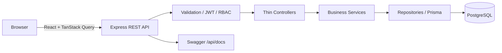
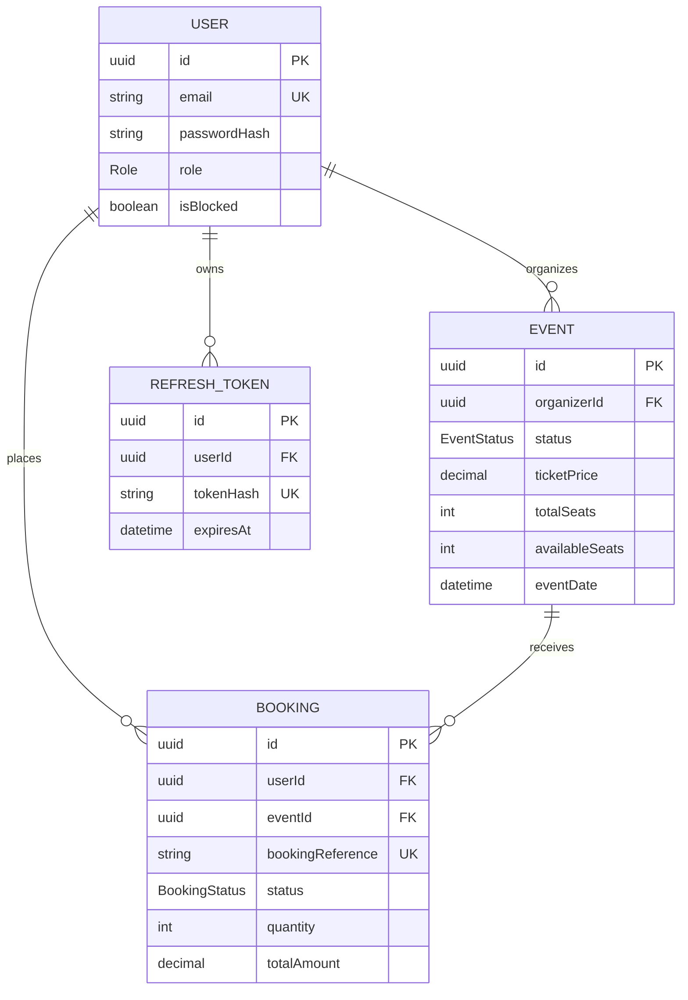

# Evently — Production-Style Event Booking System

Evently is a full-stack marketplace where attendees discover and book events, organizers manage inventory and sales, and administrators moderate the platform. It is designed as an SDE portfolio project with real authentication, relational persistence, transactions, RBAC, testing, documentation, containers, and CI—not a mock API.

## September upgrade: analytics and reliability

- Redesigned discovery homepage with search, categories, upcoming event cards and an organizer entry point.
- Organizer/admin analytics: 7/30/90-day UTC windows, confirmed booking value, tickets, cancellation rate, daily chart/table, top five events, CSV export, and 30-second refresh.
- Admin-only process telemetry: request count, p95 latency, server error rate and uptime. Latency samples are bounded to the last 2,000 requests; counters reset on restart.
- Concurrent cancellation now conditionally claims the confirmed booking before restoring seats. Cache invalidation happens after transaction commit.
- Fixed discovery pagination and sorting; concurrent expired-token requests now share one refresh operation.
- Optional Redis for shared rate limits, separate limiter key prefixes, configurable trusted proxy hops, dependency readiness and graceful HTTP draining. Discovery inventory is read directly from PostgreSQL to avoid stale availability.

### See the app and numbers locally

Run `npm run dev`, open http://localhost:5173, and log in with `demo.organizer@evently.dev` / `Password123!`. The demo organizer overview contains **synthetic** data from four labeled demo events and 48 sample bookings. These are not real customers or collected revenue. The local-only `npm run demo:analytics -w backend` adds this dataset without clearing existing records and skips previously created demo events.

Organizer analytics: `/organizer`. Admin analytics/performance: `/admin` (admin account required).

Run `node scripts/benchmark.mjs` from the root with the API running. Results are saved to `artifacts/benchmark.json`. The script only targets localhost, sends 120 reads at concurrency 8 after five warmups, and reports HTTP failures separately. Its small dataset and short local run do not establish sustained production capacity.

### Verification and deployment limits

See [verification report](artifacts/verification.md) for measured results and outstanding checks. Checkout remains simulated. Before a real paid launch, implement payment/webhook idempotency, actual refunds and email delivery; validate deployment cookies/CORS, backups and recovery; add persistent multi-replica observability and representative sustained load tests. Current admin/organizer legacy list endpoints still need bounded pagination for large datasets.

`GET /api/health` is liveness; `GET /api/ready` checks PostgreSQL and configured Redis. Leave `REDIS_URL` unset for single-process local development. Before using multiple replicas, configure shared Redis and test failover. Set `TRUST_PROXY_HOPS` to the exact number of trusted reverse proxies (default 0); do not blindly trust arbitrary forwarded IP headers. The new metrics endpoint is admin-only; it reports one process, not fleet-wide capacity. Redis outage and multi-replica behavior have not been load tested.

## Features

- JWT access tokens plus rotating, revocable refresh tokens in secure HTTP-only cookies
- `USER`, `ORGANIZER`, and `ADMIN` permissions with ownership checks and blocked-user enforcement
- Event drafting, approval, rejection, publishing, cancellation, search, filters, sorting, and pagination
- Atomic ticket inventory claims that prevent overselling under concurrent requests
- Booking history and cancellation with a 24-hour deadline and transactional seat restoration
- Organizer sales views/statistics and platform-wide admin moderation/statistics
- Responsive React UI with protected routes, validation feedback, loading/empty/error states, toasts, and confirmations
- Simulated checkout flow with no real payment or card processing
- Confirmed digital tickets with QR codes containing the booking reference, event, and ticket quantity
- Zod input validation, consistent API envelopes, centralized errors, Helmet, CORS, rate limits, Pino logging, and Swagger
- Prisma/PostgreSQL schema, deterministic seed data, integration tests, Docker Compose, and GitHub Actions CI

## Architecture



The backend follows `Route → Middleware → Controller → Service → Repository → Database`. Repository extraction is used for shared user and event persistence; transaction-heavy booking operations intentionally use the transaction-scoped Prisma client directly inside the service.

### Concurrency design

Booking runs in a PostgreSQL transaction. After validating the user and event, it issues one conditional update:

```sql
UPDATE "Event"
SET "availableSeats" = "availableSeats" - :quantity
WHERE id = :eventId AND status = 'PUBLISHED'
  AND "availableSeats" >= :quantity;
```

PostgreSQL serializes competing writes to the row and rechecks the predicate. Exactly one request can claim the final seats; a zero-row update becomes HTTP `409`, and booking creation is rolled back if any subsequent step fails. Cancellation updates the booking and restores seats in one transaction.

## Data model



## Technology

| Layer | Technology |
|---|---|
| Frontend | React 19, TypeScript, Vite, React Router, Tailwind CSS, Axios, TanStack Query, React Hook Form ecosystem, Zod |
| Backend | Node.js, Express, TypeScript, Prisma, PostgreSQL, JWT, bcrypt, Zod |
| Quality | Jest, Supertest, ESLint, Prettier, strict TypeScript |
| Operations | Docker, Docker Compose, Nginx, GitHub Actions, Pino, Swagger/OpenAPI |

## Project structure

```text
.
├── backend
│   ├── prisma/                 # Schema, migration, seed
│   ├── src
│   │   ├── config/             # Environment, Prisma, logger, Swagger
│   │   ├── controllers/        # HTTP adapters
│   │   ├── errors/             # Typed application errors
│   │   ├── middleware/         # Auth, RBAC, validation, errors
│   │   ├── repositories/       # Reusable persistence operations
│   │   ├── routes/             # REST route definitions
│   │   ├── services/           # Business rules and transactions
│   │   ├── types/              # Express type augmentation
│   │   └── utils/              # Tokens and HTTP helpers
│   └── tests/                  # Integration and concurrency tests
├── frontend
│   └── src                     # React app, API/auth state, UI, types
├── .github/workflows/ci.yml
└── docker-compose.yml
```

## Local setup

Requirements: Node.js 22+, npm 10+, PostgreSQL 16+.

```bash
npm install
cp backend/.env.example backend/.env
cp frontend/.env.example frontend/.env
npx prisma generate --schema backend/prisma/schema.prisma
npx prisma migrate dev --schema backend/prisma/schema.prisma
npm run seed -w backend
npm run dev
```

Frontend: `http://localhost:5173`
API: `http://localhost:4000/api`
Swagger: `http://localhost:4000/api/docs`

### Environment variables

Backend requires `DATABASE_URL`, `PORT`, `NODE_ENV`, `JWT_ACCESS_SECRET`, `JWT_REFRESH_SECRET`, `ACCESS_TOKEN_EXPIRY`, `REFRESH_TOKEN_EXPIRY`, `FRONTEND_URL`, and `COOKIE_SECRET`. Use random values of at least 32 characters for secrets. Frontend uses `VITE_API_BASE_URL`. Actual `.env` files are ignored.

## Docker

```bash
docker compose up --build
docker compose down
```

The app is then available at `http://localhost:3000`; the API remains at `http://localhost:4000`. PostgreSQL data persists in the named `postgres_data` volume. Do not use `docker compose down -v` unless you intend to delete local database data.

## Cloud deployment

Recommended setup:

- Database: Neon PostgreSQL
- Backend: Render Web Service
- Frontend: Vercel

### Render backend

Create a Render Web Service from this repository:

```text
Build command: npm ci && npx prisma generate --schema backend/prisma/schema.prisma && npm run build -w backend
Start command: npx prisma migrate deploy --schema backend/prisma/schema.prisma && node backend/dist/src/server.js
```

Add these environment variables:

```env
DATABASE_URL=your_neon_postgresql_connection_string
PORT=4000
NODE_ENV=production
JWT_ACCESS_SECRET=at-least-32-random-characters
JWT_REFRESH_SECRET=at-least-32-other-random-characters
ACCESS_TOKEN_EXPIRY=15m
REFRESH_TOKEN_EXPIRY=7d
FRONTEND_URL=https://your-vercel-domain.vercel.app
COOKIE_SECRET=at-least-32-random-characters
```

Verify the deployed API at `/api/health` and `/api/docs`.

### Vercel frontend

Import the repository into Vercel with:

```text
Root directory: frontend
Framework preset: Vite
Build command: npm run build
Output directory: dist
```

Add this environment variable:

```env
VITE_API_BASE_URL=https://your-render-domain.onrender.com/api
```

After deployment, set the Vercel URL as `FRONTEND_URL` in Render and redeploy the backend. Both services must use HTTPS for secure authentication cookies.

The simulated checkout does not charge money and requires no payment credentials. QR images are generated through the external QR Server endpoint and contain only the booking reference, event title, and quantity.

## Database commands

```bash
npx prisma migrate dev --schema backend/prisma/schema.prisma
npx prisma migrate deploy --schema backend/prisma/schema.prisma
npm run seed -w backend
npx prisma studio --schema backend/prisma/schema.prisma
```

## Tests and quality checks

Integration tests require an empty PostgreSQL database named `event_booking_test` (or set `TEST_DATABASE_URL`). Tests clean that database, so never point it at development or production data.

```bash
npm run typecheck
npm run lint
npm test
npm run build
```

The test suite covers registration, duplicate email, valid/invalid login, protected access, role restrictions, organizer ownership, admin approval, booking validation, cancellation ownership and inventory restoration, and concurrent booking without overselling.

## Development seed credentials

All seeded accounts use `Password123!` for local development only.

| Role | Email |
|---|---|
| Admin | `admin@evently.dev` |
| Organizer | `organizer1@evently.dev` |
| Organizer | `organizer2@evently.dev` |
| User | `user1@evently.dev` |
| User | `user2@evently.dev` |
| User | `user3@evently.dev` |

## Main API routes

- Authentication: `POST /api/auth/register`, `login`, `refresh`, `logout`; `GET /api/auth/me`
- Events: `GET /api/events`, `/api/events/:id`; organizer `POST`, `PATCH`, `DELETE`, `submit`, and `cancel`
- Bookings: `POST /api/bookings`; `GET /api/bookings/my`, `/api/bookings/:id`; `PATCH /api/bookings/:id/cancel`
- Organizer: `GET /api/organizer/events`, `/stats`, `/events/:eventId/bookings`
- Admin: `GET /api/admin/stats`, `/users`, `/events`, `/bookings`; user blocking and event approval/rejection/cancellation routes

All JSON responses use `{ success, message, data }` or `{ success, message, errors }`.

## Screenshots

Add portfolio screenshots here after running the seeded application:

- Home and event discovery
- Event details and booking confirmation
- Organizer overview and event management
- Admin moderation dashboard

## Future improvements

Real payment-provider integration, email delivery, refunds, audit logs, Redis caching, waitlists, coupons, organizer CSV exports, accessibility auditing, and end-to-end browser tests remain production extensions. The current checkout is intentionally simulated and records confirmed bookings without charging a payment method.

## Resume-ready description

> Built a role-based event marketplace with React, Express, TypeScript, PostgreSQL, and Prisma; implemented JWT refresh-token rotation, admin moderation, indexed event discovery, and transaction-safe conditional inventory updates that prevent ticket overselling under concurrent requests. Added integration tests, OpenAPI documentation, Docker Compose, structured logging, and CI quality gates.
